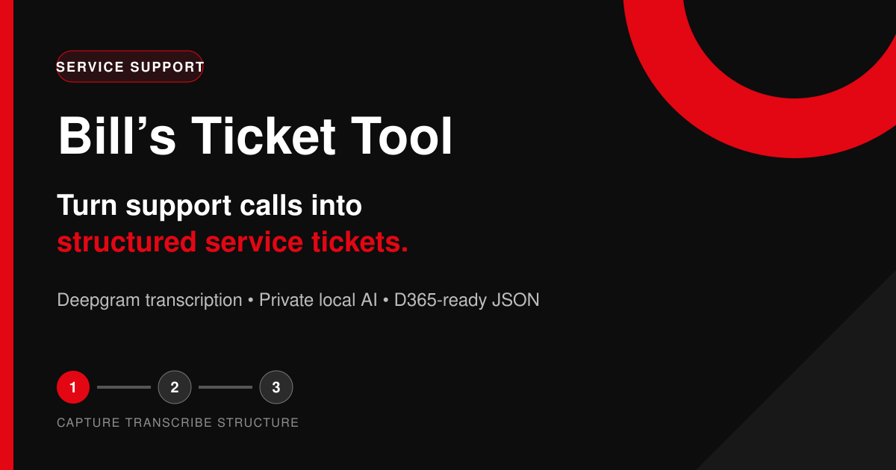

# Bill's Ticket Tool

Bill's Ticket Tool turns underground mining equipment support calls into structured service tickets.

It records or uploads a call, sends the audio to Deepgram for accurate Australian-English transcription and uses Qwen on a private BIGRIG server to interpret the conversation. Each populated ticket field includes a supporting transcript excerpt. Anything not said on the call is returned as **Not discussed**.

**Live app:** [bill-support.vercel.app](https://bill-support.vercel.app/)



## What it does

- Records a speakerphone call or uploads an audio file
- Accepts pasted and uploaded text transcripts
- Uses Deepgram Nova-3 for transcription and speaker separation
- Uses a local Qwen model to interpret different call styles and wording
- Extracts customer, machine, fault, safety and follow-up information
- Shows exact transcript evidence beside every populated value
- Marks missing facts as `Not discussed` instead of inventing them
- Displays, copies and downloads D365-ready JSON
- Includes a built-in two-speaker Australian demo call

## How we made it

The project uses a hybrid design so the web app stays easy to deploy while the interpretation remains private:

| Part | Where it runs | Technology |
|---|---|---|
| User interface | Vercel | HTML, CSS and vanilla JavaScript |
| Audio transcription | Deepgram cloud | Nova-3, Australian English, diarisation |
| Ticket interpretation | BIGRIG | Ollama with Qwen 2.5 7B |
| Private connection | User device and BIGRIG | Tailscale Serve with HTTPS |
| Source and deployments | GitHub and Vercel | Automatic deploys from `main` |

The browser sends audio to the private BIGRIG API. BIGRIG forwards only that audio to Deepgram, receives the speaker-labelled transcript, then passes the transcript to local Qwen. The local service validates that every evidence excerpt exists in the transcript before returning the ticket.

The Deepgram key is never stored in Vercel or exposed to browser JavaScript.

## Ticket fields

- Customer
- Mine site
- Caller
- Machine model
- Machine serial number
- Equipment hours
- Fault description
- Fault codes
- Machine status
- Safety risk
- Troubleshooting completed
- Recommended actions
- Call summary

Each field contains `value`, `evidence` and `confidence`. The interface currently displays the value and evidence; confidence remains available in the raw JSON.

## Use the live app

### First-time connection

1. Install Tailscale on the computer or phone that will use the tool.
2. Sign in to the same Tailscale network as BIGRIG.
3. Open [Bill's Ticket Tool](https://bill-support.vercel.app/).
4. In **Private AI connection**, paste the BIGRIG HTTPS address shown by `tailscale serve status`.
5. Select **Save & test**.
6. Wait for **Ready · Deepgram + qwen2.5:7b**.

The address is saved only in that browser, so this step is needed once per device or browser profile.

### Try the demo

1. Select **Load demo recording**.
2. The two-speaker demo call plays and its transcript loads.
3. Qwen creates the structured ticket from that transcript.
4. Review the fields and supporting evidence.
5. Select **Copy JSON** or **Download ticket**.

### Record a real call

1. Obtain recording consent from everyone on the call.
2. Put the phone on speaker near the device running the web app.
3. Select the red record button and allow microphone access.
4. Select it again to stop recording.
5. Deepgram transcribes the audio and labels the speakers.
6. Review or correct the transcript.
7. Select **Generate structured ticket**.
8. Review every field before downloading or submitting it.

### Upload a recording or transcript

1. Select **Upload recording** for MP3, WAV, M4A or WebM audio, or upload a `.txt` transcript.
2. Wait for transcription if audio was selected.
3. Review the transcript.
4. Select **Generate structured ticket**.

## Install the BIGRIG AI service

These steps are designed for Ubuntu with Docker, Portainer, an NVIDIA GPU and Tailscale already installed.

### 1. Create a Deepgram key

1. Sign in to Deepgram.
2. Open the project that contains your credit.
3. Create an API key with speech-to-text access.
4. Copy it once and store it securely.
5. Do not paste it into the web app, GitHub or this README.

### 2. Confirm Docker can see the GPU

On BIGRIG, run:

```bash
docker run --rm --gpus all nvidia/cuda:12.4.1-base-ubuntu22.04 nvidia-smi
```

If the GPU table appears, Docker is ready. If this fails, install or repair NVIDIA Container Toolkit before deploying the stack.

### 3. Deploy with Portainer

1. Open Portainer.
2. Go to **Stacks** and select **Add stack**.
3. Choose **Repository**.
4. Name the stack `bills-ticket-tool-ai`.
5. Set the repository URL to:

   ```text
   https://github.com/BillySmithDesign/bills-ticket-tool.git
   ```

6. Set the compose path to `compose.yaml`.
7. Add these environment variables in Portainer:

   ```text
   DEEPGRAM_API_KEY=your_deepgram_key
   ALLOWED_ORIGINS=https://bill-support.vercel.app
   OLLAMA_MODEL=qwen2.5:7b
   ```

8. Select **Deploy the stack**.
9. On first deployment, allow several minutes for Ollama to download Qwen.
10. Confirm all three containers finish or become healthy. `bills-ticket-model-loader` is expected to exit successfully after downloading the model.

### 4. Give the API a private HTTPS address

Run on BIGRIG:

```bash
sudo tailscale serve --bg 8787
tailscale serve status
```

Tailscale prints an address similar to:

```text
https://bigrig.your-tailnet.ts.net
```

Open that address with `/health` added from another device on the same tailnet:

```text
https://bigrig.your-tailnet.ts.net/health
```

A ready service returns JSON with `"ok": true`. Tailscale Serve is private to authenticated tailnet members and supplies HTTPS automatically. Do not use Tailscale Funnel for this internal tool.

### 5. Connect the Vercel app

1. Ensure Tailscale is connected on the device using the app.
2. Open [bill-support.vercel.app](https://bill-support.vercel.app/).
3. Paste the BIGRIG HTTPS address into **Private AI connection**.
4. Select **Save & test**.

No Vercel environment variables are required.

## Updating the service

After code is pushed to GitHub:

1. Open the stack in Portainer.
2. Select **Pull and redeploy**.
3. Keep the existing environment variables.
4. Test `/health`, then test one demo ticket in the web app.

Vercel deploys frontend changes automatically from the `main` branch.

## Run the frontend locally

```bash
git clone https://github.com/BillySmithDesign/bills-ticket-tool.git
cd bills-ticket-tool
python3 -m http.server 8080
```

Open [http://localhost:8080](http://localhost:8080). The local origin is allowed by the default server configuration.

## Test the AI service without paid calls

The integration test uses local mock Deepgram and Ollama responses, so it consumes no credits:

```bash
cd server
npm test
```

It checks the complete API flow: audio upload, speaker-labelled transcription, Qwen structured output, evidence validation and exact machine-fact extraction.

## Deploy your own Vercel copy

1. Fork this repository.
2. Import it as a new project in Vercel.
3. Choose **Other** as the framework preset.
4. Leave build, install and output settings empty.
5. Deploy.

The frontend is static. Secrets belong only in the BIGRIG Portainer stack.

## D365 Customer Service

The downloaded JSON already identifies `d365_customer_service` as its target. Direct Dataverse submission is intentionally not enabled yet because it requires:

- The Dataverse environment URL
- The Case/Incident table and destination field logical names
- Customer and contact lookup rules
- Microsoft Entra ID authentication or a Power Automate flow

Do not add D365 client secrets to `app.js`; it is public browser code.

## Project files

```text
bills-ticket-tool/
├── index.html              App layout and controls
├── styles.css              Responsive interface styling
├── app.js                  Recording, API connection and ticket UI
├── compose.yaml            Portainer/Docker stack for BIGRIG
├── .env.example            Server configuration template
├── server/
│   ├── server.js           Deepgram and Ollama gateway
│   ├── test-integration.js Mock end-to-end API test
│   ├── Dockerfile          Ticket API container
│   └── package.json        Node service commands
├── favicon.svg             Browser tab icon
├── apple-touch-icon.png    Apple home-screen icon
├── og-image.png            Social sharing preview
├── README.md               This guide
└── LICENSE                 Apache 2.0 licence
```

## Troubleshooting

### The app says BIGRIG cannot be reached

- Confirm Tailscale is connected on both devices.
- Open the `/health` address directly in the browser.
- Run `tailscale serve status` on BIGRIG.
- Confirm the `bills-ticket-api` container is running in Portainer.
- The connection address must begin with `https://`.

### Health says the model is unavailable

- Check the `bills-ticket-model-loader` logs in Portainer.
- Run `docker exec bills-ticket-ollama ollama list`.
- If needed, run `docker exec bills-ticket-ollama ollama pull qwen2.5:7b`.

### Deepgram transcription fails

- Check that `DEEPGRAM_API_KEY` is set in the Portainer stack.
- Check remaining Deepgram credit and key permissions.
- Confirm BIGRIG has outbound internet access.
- Try clear MP3 or WAV audio with speech louder than background machinery.

### Microphone access is denied

- Allow microphone access in browser site settings.
- Reload the page.
- Use the top-level Chrome, Edge or Safari browser rather than an embedded browser.

## Privacy and safety

- Obtain consent from every participant before recording.
- Audio is sent to Deepgram for transcription; review Deepgram retention settings for your account.
- Transcripts are interpreted on BIGRIG by the local Qwen model.
- Review the generated ticket before using it in D365.
- Do not rely on generated output for safety-critical decisions or site isolation procedures.

## Licence

Apache 2.0. Free to use and modify under the terms in [LICENSE](LICENSE).
